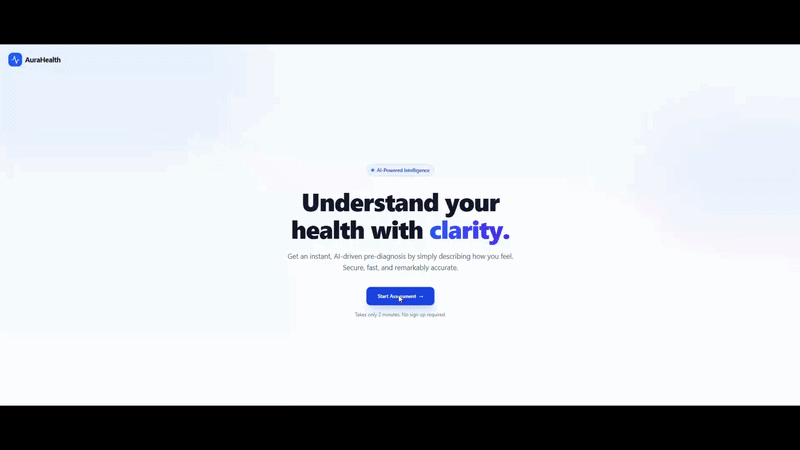
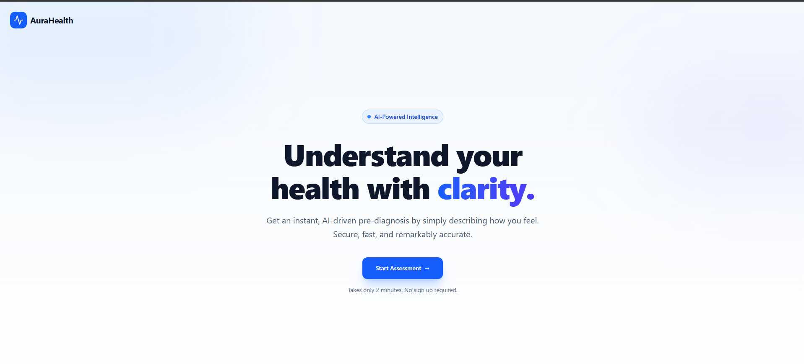
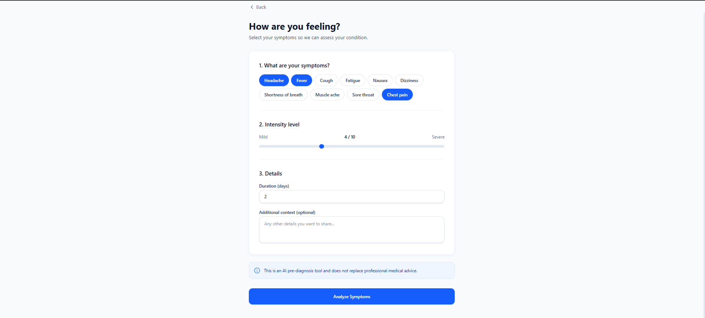
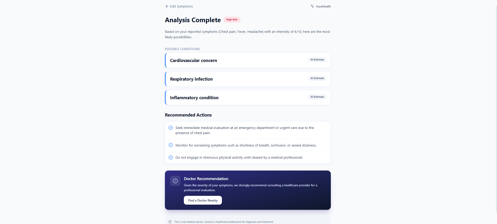

# AI Medical Pre-Diagnosis Assistant 🩺✨

[](https://opensource.org/licenses/MIT)
[](https://reactjs.org/)
[](https://www.djangoproject.com/)
[](https://ai.google.dev/)

A professional, SaaS-style AI-powered web application designed to help users perform a preliminary health assessment. By analyzing symptoms, intensity, and duration, the assistant provides possible conditions, risk levels, and actionable advice.

> [!IMPORTANT]
> **Medical Disclaimer:** This application is for **educational purposes only**. It does NOT provide clinical diagnoses or replace professional medical advice, diagnosis, or treatment. Always seek the advice of your physician or other qualified health provider.

---

## 🚀 Demo


---

## ✨ Features

- 🧩 **Interactive Symptom Selection**: Dynamic UI using chips for quick symptom picking.
- 🎚️ **Intensity & Duration**: Precision input with sliders (1–10) and duration tracking.
- 🤖 **AI-Powered Analysis**: Real-time health assessment using Google Gemini API.
- ⚠️ **Risk Level Detection**: Automated categorization (Low / Medium / High).
- 📋 **Condition Suggestions**: Provides the top 3 most likely conditions based on input.
- 💡 **Recommended Actions**: Tailored advice for each assessment.
- 🚨 **Emergency Alerts**: Immediate recommendations for professional medical consultation.
- 🔄 **AI Provider Toggle**: Seamless switch system between **Mock Mode** (for development) and **Gemini API**.
- 💎 **Modern SaaS UI**: Built with a clean, responsive aesthetic using TailwindCSS and Framer Motion.

---

## 🛠️ Tech Stack

### Frontend
- **Framework**: React.js
- **Styling**: TailwindCSS
- **Animations**: Framer Motion
- **Icons**: Lucide React
- **HTTP Client**: Axios

### Backend
- **Framework**: Django
- **API**: Django REST Framework (DRF)
- **AI Integration**: Google Gemini API
- **Language**: Python 3.x

---

## 🏛️ Architecture Overview

The project follows a modular, scalable architecture to ensure separation of concerns:

- **Modular Django Apps**:
  - `api/`: Handles REST endpoints and request/response flow.
  - `ai_engine/`: Manages AI logic and provider abstractions.
  - `triage/`: Contains rules and logic for risk assessment.
- **Provider Factory Pattern**: A clean abstraction layer allowing the system to switch between `MockProvider` and `GeminiProvider` without changing business logic.
- **Service Layer**: Business logic is decoupled from views to ensure maintainability.
- **Serializers**: Strict input validation and structured data formatting using DRF.

---

## ⚙️ Installation & Setup

### 1. Clone the repository
```bash
git clone https://github.com/yourusername/ai-med-assistant.git
cd ai-med-assistant
```

### 2. Backend Setup
```bash
cd backend
# Create and activate virtual environment
python -m venv venv
source venv/bin/activate  # On Windows: venv\Scripts\activate

# Install dependencies
pip install -r requirements.txt

# Run migrations
python manage.py migrate

# Start the server
python manage.py runserver
```

### 3. Frontend Setup
```bash
cd ../frontend

# Install dependencies
npm install

# Start the development server
npm run dev
```

---

## 🔑 Environment Variables

Create a `.env` file in the `backend/` directory:

```env
# AI Configuration (mock or gemini)
AI_MODE=gemini

# Google Gemini API Key
GEMINI_API_KEY=your_google_gemini_api_key_here

# Django Settings
DEBUG=True
SECRET_KEY=your_django_secret_key
```

---

## 📡 API Endpoint Example

### Analyze Symptoms
**Endpoint**: `POST /api/analyze/`

**Request Body**:
```json
{
  "symptoms": ["Headache", "Fever"],
  "intensity": 7,
  "duration": 3,
  "notes": "Persistent pain behind the eyes."
}
```

**Response**:
```json
{
  "risk_level": "Medium",
  "possible_conditions": [
    "Migraine",
    "Viral Infection",
    "Sinusitis"
  ],
  "recommendations": "Stay hydrated and rest. If fever persists, consult a doctor.",
  "provider_used": "gemini"
}
```

---

## 📸 Screenshots
### 🏠 Landing Page
<p align="center">
  
</p>
### 🏠 Symptom Analysis Page
<p align="center">
  
</p>
### 🏠 Result Page
<p align="center">
  
</p>


---

## 🔮 Future Improvements

- [ ] **Multi-language Support**: Health assessments in multiple languages.
- [ ] **Voice Interaction**: Describe symptoms using voice-to-text.
- [ ] **PDF Reports**: Export assessment summaries for doctor visits.
- [ ] **User History**: Secure dashboard to track symptoms over time.
- [ ] **Doctor Integration**: Direct booking links based on detected conditions.

---

## ⚖️ Disclaimer
This project is an AI-driven tool for information purposes only. The information provided is not a substitute for professional medical advice, diagnosis, or treatment. **If you are experiencing a medical emergency, please contact your local emergency services immediately.**

---

## 👨‍💻 Author
**[Eya Ammar]**
- LinkedIn: [Your Profile](https://www.linkedin.com/in/eya-ammar-0932b12b2/)


## 🐳 Run with Docker
```bash
docker-compose up --build
```